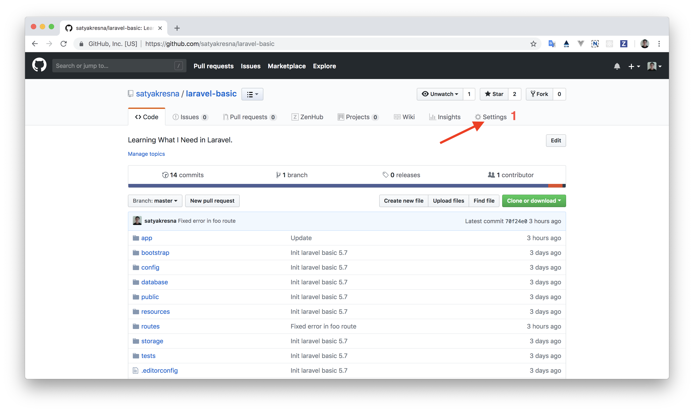
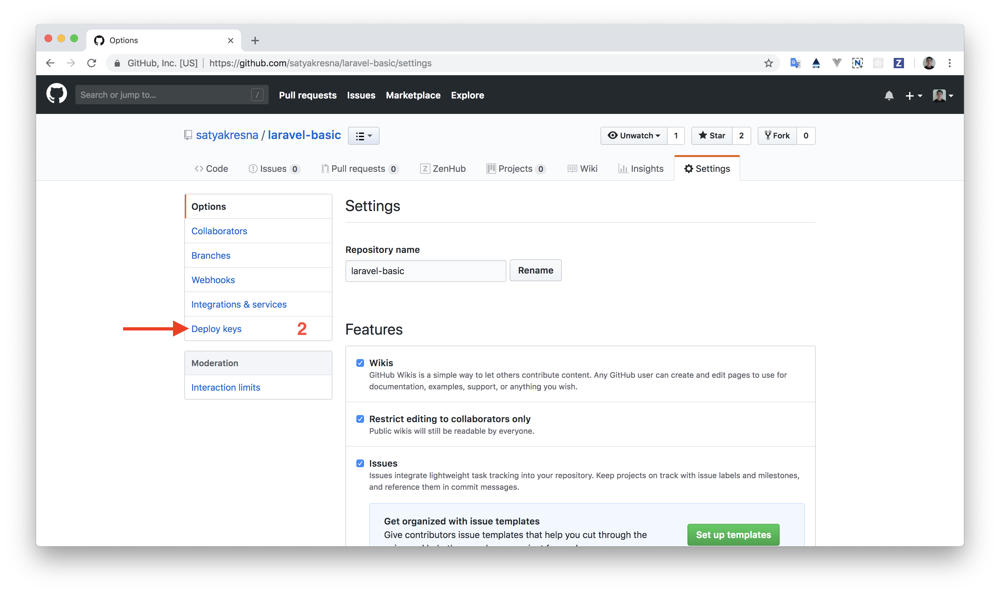
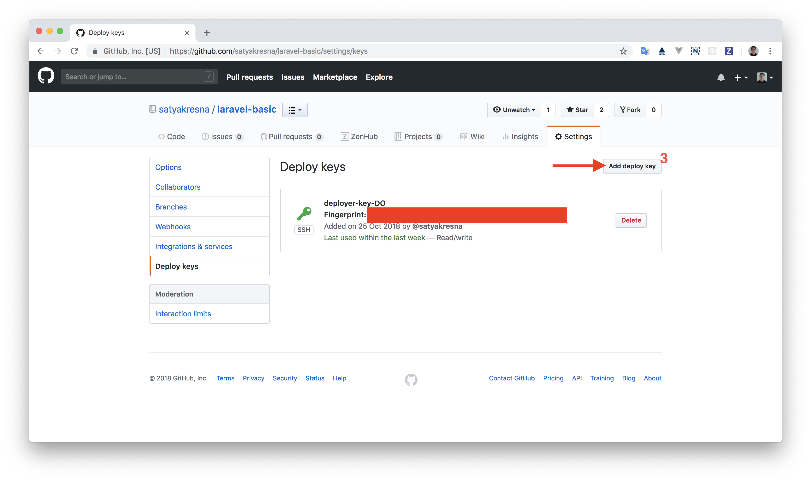
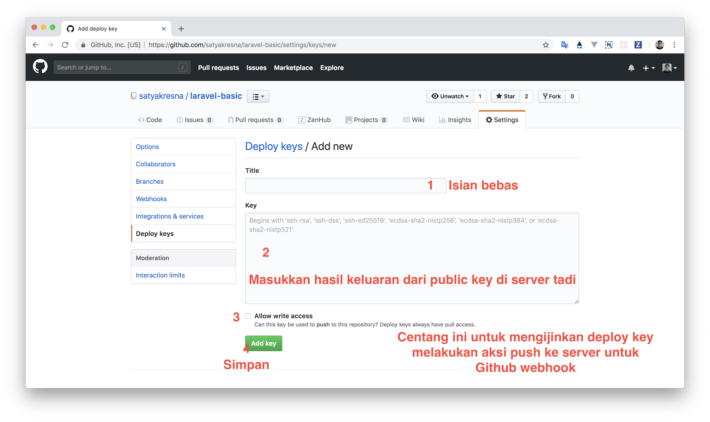

# Cara deploy web Laravel dengan Github Webhook.
Bagi teman-teman yang memiliki VPS, mempunyai repository Github yang berisikan web Laravel serta kebingungan cara menyebarkan aplikasi Anda (deploy) maka Anda berada di tempat yang tepat. Di tulisan ini saya akan berbagi cara konfigurasinya.

## Persiapan
1. Mempunyai VPS
1. Membuat SSH key di VPS dan menaruh public key di repository yang Anda punya.
1. Melakukan konfigurasi `sudo` tanpa password untuk reload php-fpm dan chown

### Membuat SSH key di VPS dan menaruhnya di repository yang Anda punya.
Jika Anda belum membuat SSH key di VPS dengan user yang Anda butuhkan (misalnya: ```deployer```),
silahkan ikuti [panduan dari Github tentang cara membuat SSH key](https://help.github.com/articles/generating-a-new-ssh-key-and-adding-it-to-the-ssh-agent/).
Bagi Anda yang sudah membuat lanjut ke langkah di bawah ini untuk mencetak public key:

```bash
cd ~/.ssh
cat id_rsa.pub
```

Selanjutnya, copy paste hasil keluaran tersebut dan taruh di repository Github Anda => Settings => Deploy keys. Saya akan ambil repository ```laravel-basic``` sebagai contoh.









### Melakukan konfigurasi `sudo` tanpa password untuk reload php-fpm dan chown
Silahkan login dengan user yang memiliki akses sudo atau user root dan ketik perintah ```sudo visudo``` dan sisipkan baris ini di paling bawah.

```bash
# For reload php 7.2
%deployer ALL = NOPASSWD: /usr/sbin/service php7.2-fpm reload
%www-data ALL=(ALL:ALL) NOPASSWD: /usr/sbin/service php7.2-fpm reload

# Allow user to run commands without passwd ex. chown
%deployer ALL = NOPASSWD: /bin/chown
```

## Mulai
