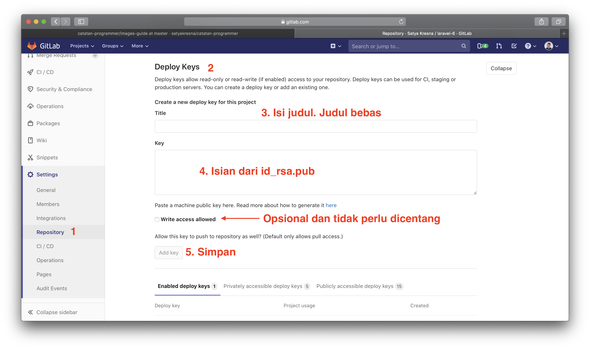
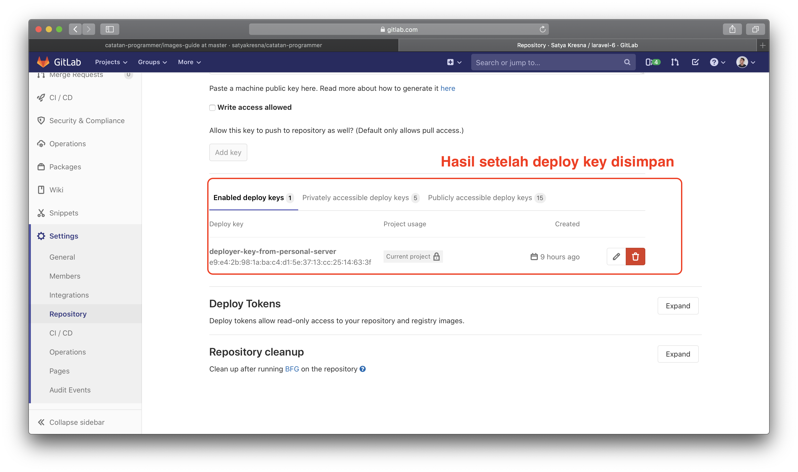
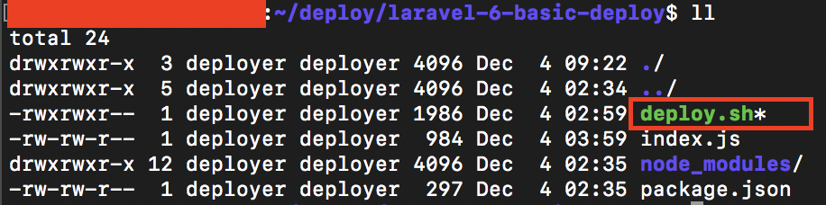
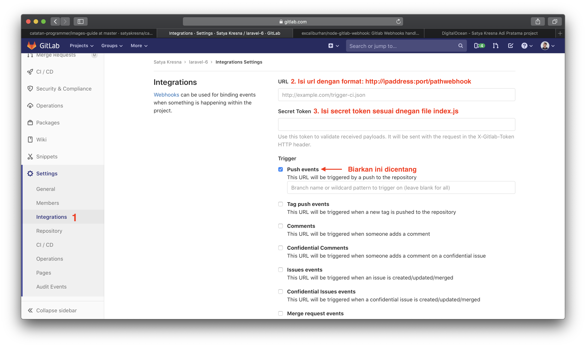
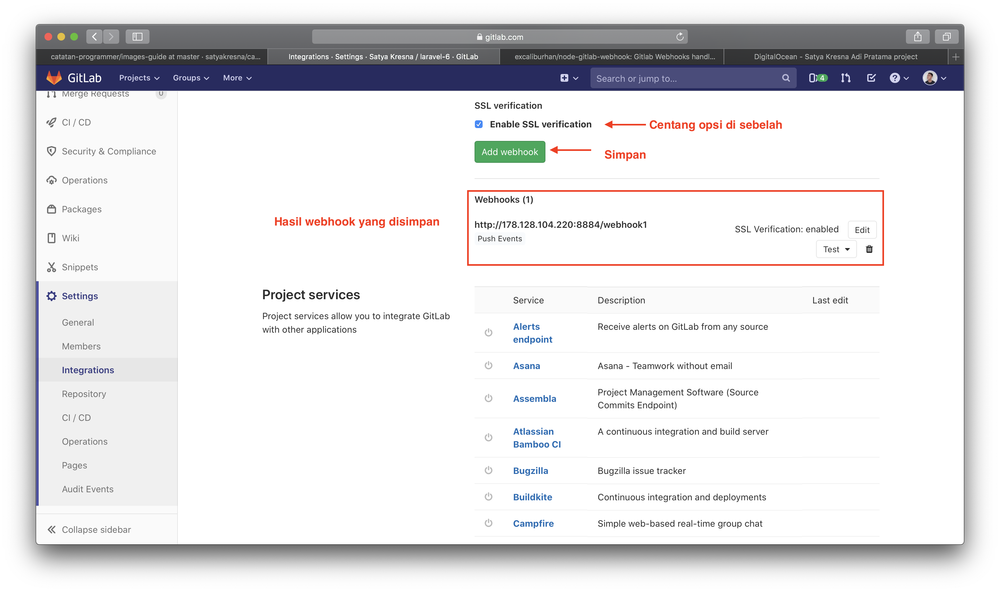
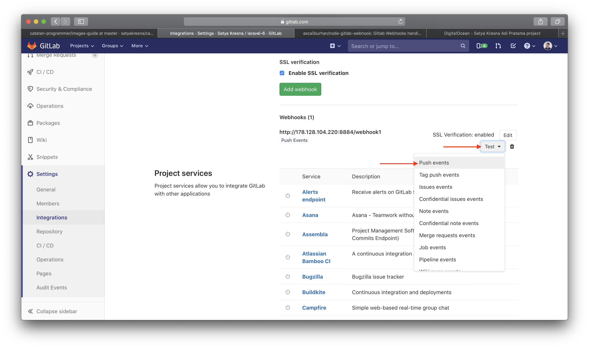
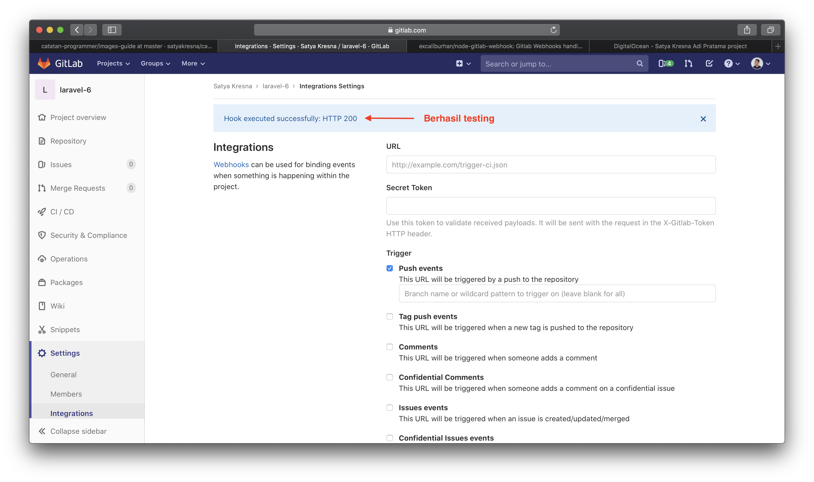
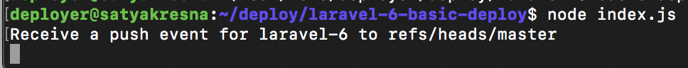
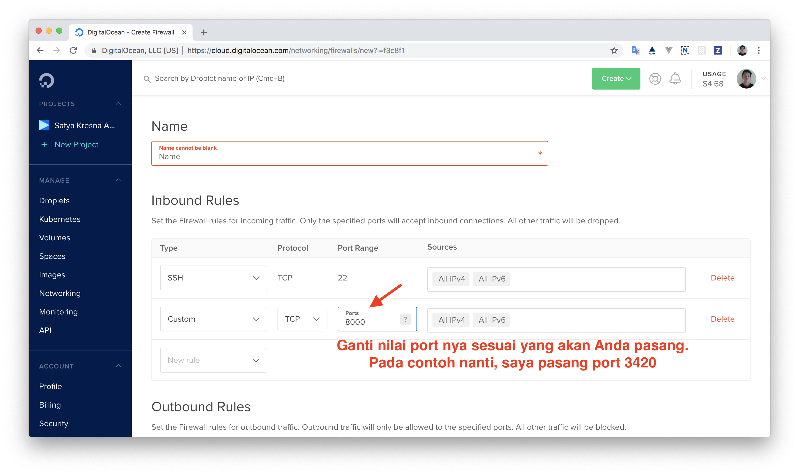

# Cara deploy web Laravel dengan Gitlab Webhook.
Bagi teman-teman yang memiliki VPS, mempunyai repository Gitlab yang berisikan web Laravel serta kebingungan cara menyebarkan aplikasi Anda (deploy) maka Anda berada di tempat yang tepat. Di tulisan ini saya akan berbagi cara konfigurasinya.

## Persiapan
1. Mempunyai VPS dan saya menggunakan Ubuntu
1. Membuat SSH key di VPS dan menaruh public key di repository yang Anda punya.
1. Melakukan konfigurasi `sudo` tanpa password untuk reload php-fpm untuk group www-data
1. Memasang port custom di firewall.

## Setup ACL dan Menambahkannya ke www-data
1. Membuat user bernama **deployer** dan menambahkannya ke grup www-data ke **deployer**
```
# as root
adduser deployer

# Append (-a) a secondary group (-G) "www-data" to user "deployer"
usermod -a -G www-data deployer

# See groups assigned to user "deployer"
groups deployer
```
1. Menambahkan ACL permissions di `/var/www`
```
# check setfacl exists
which setfacl

# If doesn't exist:
sudo apt-get install -y acl

# Inspect current ACL's
getfacl /var/www

# Set current and default ACL's for /var/www
sudo setfacl -Rm g:www-data:rwx,d:g:www-data:rwx /var/www
```

Sekarang user deployer (bagian dari grup www-data) dapat membaca, menulis dan mengeksekusi direktori file di root `/var/www`.

### Membuat SSH key di VPS dan menaruhnya di repository yang Anda punya.
Jika Anda belum membuat SSH key di VPS dengan user yang Anda butuhkan (misalnya: ```deployer```),
silahkan ikuti [panduan dari Github tentang cara membuat SSH key](https://help.github.com/articles/generating-a-new-ssh-key-and-adding-it-to-the-ssh-agent/).
Bagi Anda yang sudah membuat lanjut ke langkah di bawah ini untuk mencetak public key:

```bash
cd ~/.ssh
cat id_rsa.pub
```

Selanjutnya, copy paste hasil keluaran tersebut dan taruh di repository Github Anda => Settings => Repository. Saya akan ambil repository ```laravel-6``` sebagai contoh.





### Melakukan konfigurasi `sudo` tanpa password untuk reload php-fpm
Silahkan login dengan user yang memiliki akses sudo atau user root dan ketik perintah ```sudo visudo``` dan sisipkan baris ini di paling bawah.

```bash
# For reload php 7.2
%www-data ALL=(ALL:ALL) NOPASSWD: /usr/sbin/service php7.2-fpm reload
```

### Memasang port custom di firewall.
Karena kita akan menggunakan package Github Webhook dan NodeJS, pastikan Anda memasang port custom di firewall agar firewall membuka akses custom port. Kita bisa memasangnya langsung di terminal server kita.

```bash
# nomor 3420 hanyalah contoh, Anda bisa menggantinya sesuai kebutuhan
sudo ufw allow 3420/tcp
# Melakukan pengecekan bila port 3420 masuk dalam daftar
sudo ufw status verbose
```

Catatan: Setelah itu, silahkan logout dari server dan login ke server.

## Mulai tahap 1
1. Membuat direktori untuk deploy hook. Saya membuat folder bernama **laravel-6-basic-deploy** di direktori ```/home/deployer/deploy/laravel-6-basic-deploy```
2. Menginstall nodejs dan npm di VPS dengan cara:
```bash
sudo apt update
sudo apt install nodejs
sudo apt install npm
# test nodejs
nodejs -v
```
3. Init NPM project dengan cara: ```npm init``` dan masukkan data-data yang diperlukan serta pastikan "main" diisi dengan value "index.js".
4. Download package github hook dengan perintah: ```npm install --save node-gitlab-webhook```
5. Membuat file index.js dan isilah script di bawah ini

```js
const http = require('http');
const createHandler = require('node-gitlab-webhook');
// single handler
const handler = createHandler({ path: '/webhook1', secret: 'secret1' });
const execFile = require('child_process').execFile;

http.createServer(function (req, res) {
  handler(req, res, function (err) {
    res.statusCode = 404;
    res.end('no such location');
  });
}).listen(3420);

handler.on('error', function (err) {
  console.error('Error:', err.message);
});

handler.on('push', function (event) {
  console.log(
    'Received a push event for %s to %s',
    event.payload.repository.name,
    event.payload.ref
  );
  
    // Exec a shell script
    const execOptions = {
        maxBuffer: 1024 * 1024 // Increase max buffer to 1mb
    };

    // '/home/deployer/deploy/laravel-basic-deploy/deploy.sh' adalah direktori untuk menjalankan shell script
    // Tergantung di mana Anda mau taruh.
    execFile('/home/deployer/deploy/laravel-6-basic-deploy/deploy.sh', execOptions, function(error, stdout, stderr) {
        if( error )
        {
            console.log(error)
        }
    });
});
```
6. Membuat file deploy.sh dan isilah script di bawah ini

```bash
#!/usr/bin/env bash

REPO='git@gitlab.com:satyakresna/laravel-6.git'; #nama repo saya
RELEASE_DIR='/var/www/laravel-6/releases'; # direktori aplikasi saya
APP_DIR='/var/www/laravel-6/app'; # direktori aplikasi saya
RELEASE="release_`date +%Y%m%d%H%M%s`";
# tempat saya menaruh .env production file
# Jika Anda tidak ingin mengikuti cara ini pastikan Anda hapus perintah
# yang ada komentar # Copy .env file
ENV_PRODUCTION='/home/deployer/env-laravel/laravel-6/production/.env';
ROOT_DIR='/var/www/laravel-6';
SHARED_DIR='/var/www/laravel-6/shared';

# Fetch Latest Code
[ -d $RELEASE_DIR ] || mkdir -p $RELEASE_DIR;
cd $RELEASE_DIR;
git clone -b master $REPO $RELEASE;

# Composer
cd $RELEASE_DIR/$RELEASE;
composer install --no-ansi --no-dev --no-interaction --no-progress --no-scripts --optimize-autoloader;
php artisan clear-compiled --env=production;
php artisan optimize --env=production;

# Update permissions
cd $RELEASE_DIR;
chgrp -R www-data $RELEASE;
chmod -R ug+rwx $RELEASE;

# Check if shared directory is not exist
if [ ! -d "$SHARED_DIR" ]; then
# Create shared directory
mkdir $ROOT_DIR/shared;
cd $ROOT_DIR/shared && (mkdir -p storage storage/app storage/app/public storage/framework storage/framework/cache storage/framework/sessions storage/framework/views storage/logs);
fi

# Copy .env file
cp $ENV_PRODUCTION $ROOT_DIR/shared;

## Env File
cd $RELEASE_DIR/$RELEASE;
ln -nfs ../../shared/.env .env;
chgrp -h www-data .env;

## Storage
rm -r $RELEASE_DIR/$RELEASE/storage;
cd $RELEASE_DIR/$RELEASE;
ln -nfs ../../shared/storage storage;
chgrp -h www-data storage;

## Update Current Site
ln -nfs $RELEASE_DIR/$RELEASE $APP_DIR;
chgrp -h www-data $APP_DIR;

## PHP
sudo service php7.2-fpm reload;

## Setup artisan key generate command
cd $APP_DIR;
php artisan key:generate

# Clear conf
php artisan config:clear
php artisan config:cache

# Run migration if you need
php artisan migrate --force

# Symlink storage folder with public folder
php artisan storage:link
```
6. Berikan akses execute untuk deploy.sh dengan perintah:
```bash
chmod ug+x deploy.sh
```
7. Hasil akhir seperti gambar di bawah



8. Coba jalankan perintah ```bash deploy.sh``` dan apakah berjalan dengan lancar?
Semoga berhasil.

## Mulai tahap 2
1. Lakukan konfigurasi webhook di Gitlab dari repository kita ke menu Settings => Integerations dan hasilnya seperti gambar di bawah ini.





2. Jalankan perintah ```node index.js``` di dalam direktori tadi dan lakukan testing git push pada dropdown `test` di Webhooks yang disediakan Gitlab. Hasilnya akan seperti gambar di bawah di terminal maupun di Gitlab webhook.







**Catatan:** *Jika Anda mengalami service time out di Github hooks, kemungkinan besar adalah Anda tidak memasang port
di VPS Anda atau port Anda pasang salah. Mohon dicek lebih teliti lagi.*

## Mulai tahap 3
Tentunya kita tidak ingin setiap kali buka terminal dan menjalankan perintah ```node index.js```.
Salah satu cara untuk menghindari ini adalah dengan membuat service yang menjalankan perintah node tadi.
Pada tutorial ini saya akan menggunakan `systemd` dari Ubuntu.

1. Login sebagai user yang memiliki akses sudo atau user root dan masukkan perintah di bawah ini:
```bash
# perintah ini bertujuan untuk mengarahkan Anda ke direktori system dan dari sinilah kita akan membuat service
cd /lib/systemd/system
```
2. Kemudian buat file bernama **laravel-6-deploy.service** dan isinya seperti berikut:
```
[Unit]
Description=Laravel 6 Gitlab Webhook

[Service]
User=deployer
Group=www-data
Restart=on-failure
ExecStart=/usr/bin/node /home/deployer/deploy/laravel-6-basic-deploy/index.js

[Install]
WantedBy=multi-user.target
```
3. Simpan isi file tersebut dan jalankan perintah ```sudo systemctl enable laravel-basic-deploy.service```
4. Jalankan lagi perintah ```sudo systemctl start laravel-basic-deploy.service```
5. Berikutnya kita cek apakah service yang kita buat berjalan atau tidak dengan cara ```sudo systemctl status laravel-basic-deploy.service``` dan hasilnya seperti gambar di bawah



6. Coba ubah kodingan Anda dan lakukan git push apakah hasilnya sesuai atau tidak? Jika sesuai berarti service kita berjalan dengan lancar.

## Tambahan
Jika butuh setup deploy dengan nginx silahkan buka [link ini](https://gist.github.com/satyakresna/9d59afb47a3ff64ab1d3bb3ba353f4cd)

## Sumber referensi
1. [Servers for hacker auto deploy with Github](https://serversforhackers.com/c/automating-deployment-from-github)
1. [Servers for hacker enhancing envoy deployment](https://serversforhackers.com/c/enhancing-envoy-deployment)
1. [Node Gitlab Webhook](https://github.com/excaliburhan/node-gitlab-webhook)